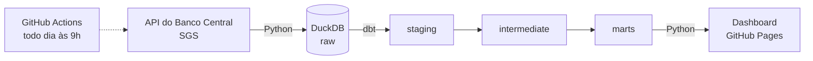

# 📈 Economia do Brasil em Dados

Pipeline de dados de ponta a ponta que busca todo dia os principais indicadores da economia brasileira na API do Banco Central, modela tudo em SQL com dbt, testa a qualidade dos dados e publica um dashboard atualizado sozinho.

**[🌐 Ver o dashboard ao vivo](https://myttrindade.github.io/pipeline-economia-brasil/)**

## Arquitetura



| Etapa | Ferramenta | O que faz |
|---|---|---|
| Extração | Python + requests | Baixa 5 séries do SGS desde 2012, em janelas de 5 anos (limite da API), com novas tentativas em caso de falha |
| Armazenamento | DuckDB | Banco analítico em arquivo, com a camada `raw` recarregada a cada execução (idempotente) |
| Transformação | dbt | Camadas `staging` → `intermediate` → `marts`, com documentação e testes |
| Qualidade | testes do dbt | 25 testes: chaves únicas, nulos, integridade referencial, faixas de valores plausíveis e ausência de datas futuras |
| Visualização | HTML + Chart.js | Página estática gerada a partir dos marts, com modo claro/escuro e download dos dados em CSV |
| Orquestração | GitHub Actions | Roda o pipeline todo dia e publica no GitHub Pages |

## Indicadores

| Série SGS | Indicador | Frequência |
|---|---|---|
| 432 | Meta da taxa Selic (% a.a.) | diária |
| 1 | Dólar comercial PTAX, venda (R$) | diária |
| 433 | IPCA, variação mensal (%) | mensal |
| 13522 | IPCA acumulado em 12 meses (%) | mensal |
| 24369 | Taxa de desocupação, PNAD Contínua (%) | mensal |

A partir dessas séries, o modelo calcula o **juro real ex-post** (Selic descontada do IPCA de 12 meses), a **variação mensal do dólar** e identifica cada **decisão do Copom** pelas mudanças na meta Selic.

## Modelos dbt

- **`stg_bcb__observacoes`**: observações tipadas, sem duplicatas e com o nome da série
- **`int_series__mensal`**: todas as séries no grão mensal (média e último valor do mês)
- **`fct_indicadores_mensais`**: uma linha por mês com todos os indicadores, base do dashboard
- **`fct_decisoes_copom`**: uma linha por mudança na meta Selic, com a variação em pontos percentuais

## Como rodar localmente

```bash
python -m venv .venv
.venv/Scripts/activate          # no Linux/macOS: source .venv/bin/activate
pip install -r requirements.txt

python extract/bcb_sgs.py                         # extração
cd transform && dbt build --profiles-dir . && cd ..  # transformação + testes
python dashboard/build.py                         # gera site/index.html
```

## Estrutura

```text
extract/bcb_sgs.py        extração da API do Banco Central
transform/                projeto dbt (seeds, models, tests, macros)
dashboard/                template e gerador do dashboard
.github/workflows/        agendamento e publicação
```

> Fonte: Banco Central do Brasil, Sistema Gerenciador de Séries Temporais (SGS).
